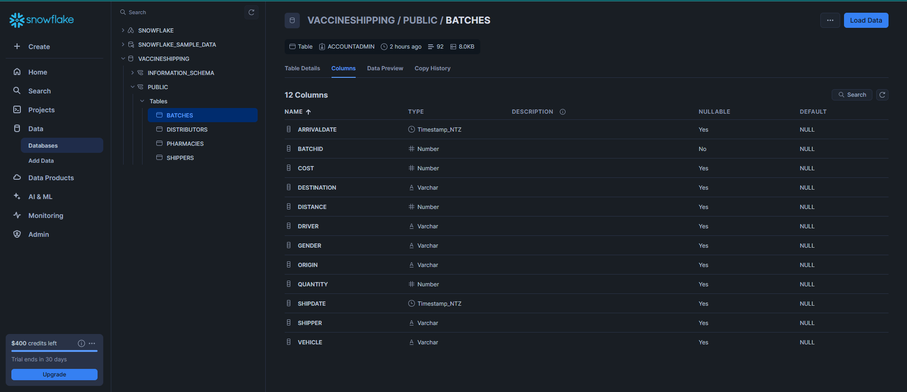

Started by creating a database and the tables from the sql file provided on snowflake.
the tables were populated according to the data provided from the `VaccineShipping.sql` file.

## SQL related task
you can find all the sql related result in this file => [sql task](task.md)
the result were exported in `.csv` files if needed for each and every questions.
## Business Judgment
Answers to the Business side of the task is in this file => [Business Judgment](BusinessJudgment.md)
