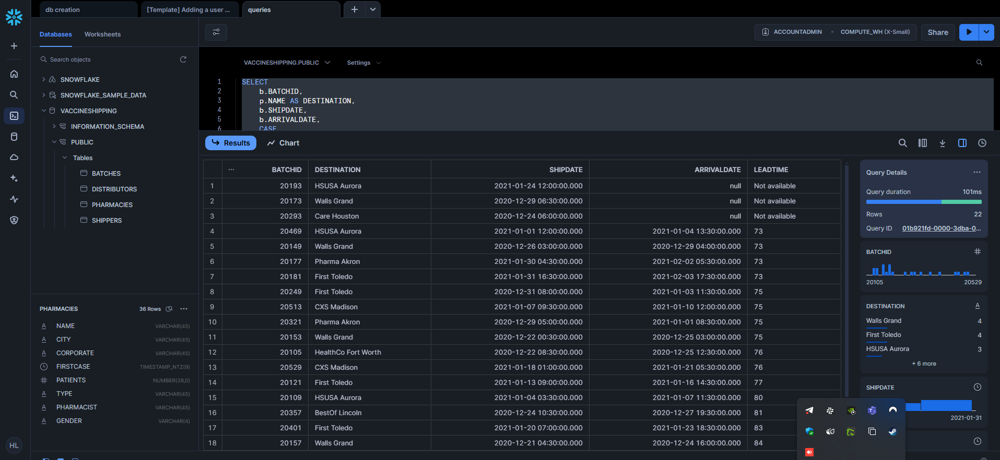
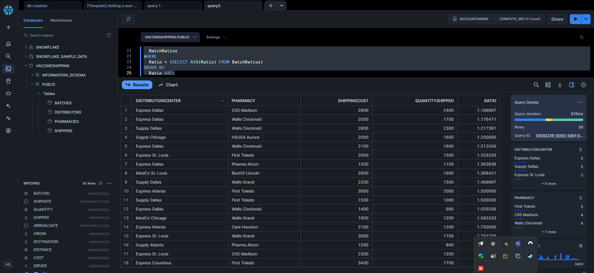
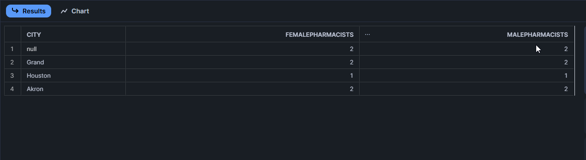
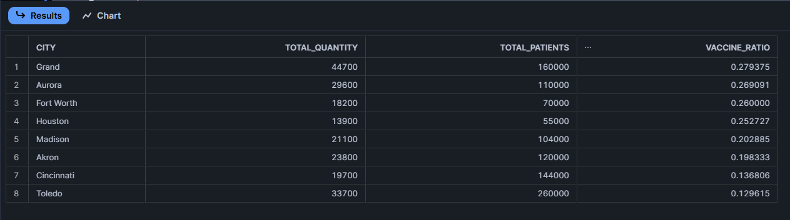
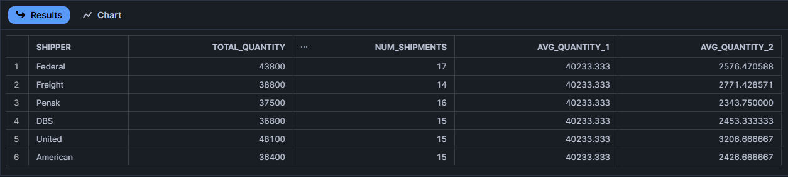
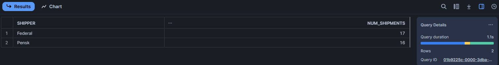
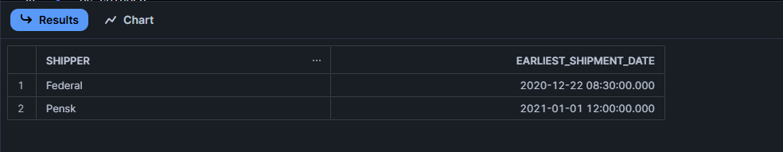
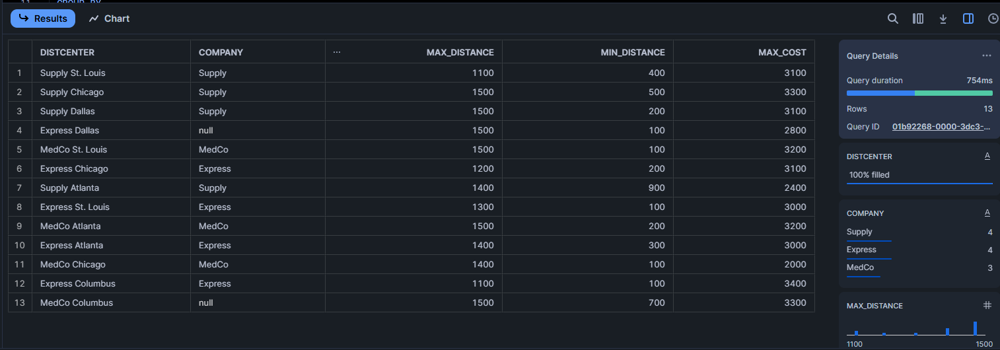
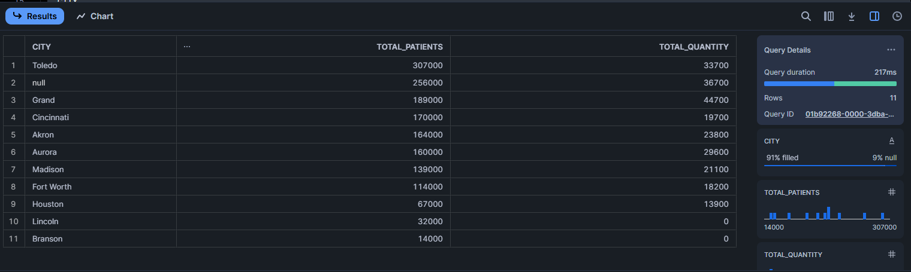

## Task 1
For each shipment sent before February 1, 2021, calculate the lead-time in hours.
Lead time is the difference between the shipping and arrival dates. List the
BatchID, destination, ship date, arrival date, and lead time. If the arrival time is
not available, lead time should be tagged as “Not available”. Sort results by
lead-time.

### Query:
```sql
SELECT
    b.BATCHID,
    p.NAME AS DESTINATION,
    b.SHIPDATE,
    b.ARRIVALDATE,
    CASE
    -- because of the else value being a string , the numbers are converted to string too.
        WHEN b.ARRIVALDATE IS NOT NULL THEN TO_VARCHAR( TIMEDIFF(HOUR, b.SHIPDATE, b.ARRIVALDATE) )
        ELSE 'Not available'
    END AS LEADTIME
FROM
    BATCHES b
LEFT JOIN PHARMACIES p ON b.DESTINATION = p.NAME
WHERE
    b.SHIPDATE < '2021-02-01'
ORDER BY
    CASE
        WHEN b.ARRIVALDATE IS NOT NULL THEN TIMEDIFF(HOUR, b.ARRIVALDATE, b.SHIPDATE)
        ELSE NULL
    END DESC;
```
### the result of the query is:


you can see the result in the image above (an export of the result is available in the same folder as this file [query1.csv](query1.csv)) and the query in the code block above.

## Task 2
Calculate the ratio between the cost of shipping a batch and the quantity shipped
for each batch. List ONLY those shipments that have a ratio that is more than
the average ratio, of all shipments. Sort the results in increasing order of this
ratio. List in your printout the distribution center, the pharmacy for these
shipments, cost of the shipment, quantity shipped, and the ratio. For average
ratio, use AVG function (HINT: AVG(Cost/Quantity)). No need to treat nulls.

### Query:
```sql
WITH BATCHRATIOS AS (
  SELECT
    d.DISTCENTER AS DISTRIBUTIONCENTER,
    p.NAME AS PHARMACY,
    b.COST as SHIPPINGCOST,
    b.QUANTITY AS QUANTITYSHIPPED,
    b.COST / b.QUANTITY AS RATIO
  FROM
    BATCHES b
  JOIN DISTRIBUTORS d ON b.ORIGIN = d.DISTCENTER
  JOIN PHARMACIES p ON b.DESTINATION = p.NAME
)

SELECT
  DISTRIBUTIONCENTER,
  PHARMACY,
  SHIPPINGCOST,
  QUANTITYSHIPPED,
  RATIO
FROM
  BATCHRATIOS
WHERE
  RATIO > (SELECT AVG(RATIO) FROM BATCHRATIOS)
ORDER BY
  RATIO ASC;
```

### the result of the query is:


you can see the result in the image above (an export of the result is available in the same folder as this file [query2.csv](query2.csv)) and the query in the code block above.

## Task 3

Find cities that have the same number of female and male pharmacists. List the
city, number of female pharmacists, and number of male pharmacists. Do not
remove the null city

### Query:
```sql
WITH PHARMACIST_SEX AS (
SELECT
  p.CITY,
  COUNT(CASE WHEN p.GENDER = 'F' THEN 1 END) AS FEMALEPHARMACISTS,
  COUNT(CASE WHEN p.GENDER = 'M' THEN 1 END) AS MALEPHARMACISTS
FROM
  PHARMACIES p
GROUP BY
  p.CITY
)

SELECT *
FROM PHARMACIST_SEX ps
WHERE ps.FEMALEPHARMACISTS = ps.MALEPHARMACISTS;
```

### the result of the query is:


you can see the result in the image above (an export of the result is available in the same folder as this file [query3.csv](query3.csv)) and the query in the code block above.

## Task 4
Find the distributors that have not participated in the program (didn’t send any
batches). List the name of the distribution center, name of the company, and
name of the manager.

### Query:
```sql
SELECT
  d.DISTCENTER,
  d.COMPANY,
  d.MANAGER
FROM
  DISTRIBUTORS d
LEFT JOIN BATCHES b ON d.DISTCENTER = b.ORIGIN
WHERE
  b.BATCHID IS NULL;
```

### the result of the query is:


you can see the result in the image above (an export of the result is available in the same folder as this file [query4.csv](query4.csv)) and the query in the code block above.

## Task 5
For each city (cities from pharmacy table), calculate the ratio of total quantity of
vaccines received to the number of patients who need the vaccine in the city.
Sort the results by this ratio. Include ONLY pharmacies that received vaccines
in this calculation. Do not report NULL city. Hint: It is not as simple as you think!
Take another look at your results and check the result. You need to use
subqueries

### Query:
```sql
WITH CityVaccineData AS (
  SELECT
    p.CITY,
    SUM(b.QUANTITY) AS TOTAL_QUANTITY,
    SUM(p.PATIENTS) AS TOTAL_PATIENTS
  FROM
    Pharmacies p
  JOIN Batches b ON p.NAME = b.DESTINATION
  GROUP BY
    p.CITY
)

SELECT
  CITY,
  TOTAL_QUANTITY,
  TOTAL_PATIENTS,
  TOTAL_QUANTITY / TOTAL_PATIENTS AS VACCINE_RATIO
FROM
  CityVaccineData
WHERE
  TOTAL_QUANTITY > 0 and CITY IS NOT NULL
ORDER BY
  VACCINE_RATIO DESC;
```

### the result of the query is:


you can see the result in the image above (an export of the result is available in the same folder as this file [query5.csv](query5.csv)) and the query in the code block above.

## Task 6

Find the average quantity shipped by each shipper that have shipped at least a
batch. Calculate the average number two times, once by using AVG function,
and then using the original calculation (sum/n). Is there any difference? Why?
Which one is correct?

### Query:
```sql
WITH SHIPPER_STATS AS ( 
/*
calculates the total quantity shipped and the number of shipments for each shipper.
It filters out shippers who haven't shipped any batches.
*/
  SELECT
    S.SHIPPER,
    SUM(B.QUANTITY) AS TOTAL_QUANTITY,
    COUNT(B.BATCHID) AS NUM_SHIPMENTS
  FROM
    SHIPPERS S
  JOIN BATCHES B ON S.SHIPPER = B.SHIPPER
  GROUP BY
    S.SHIPPER
  HAVING
    COUNT(B.BATCHID) > 0
)

SELECT
  SHIPPER,
  TOTAL_QUANTITY,
  NUM_SHIPMENTS,
  AVG(TOTAL_QUANTITY) OVER () AS AVG_QUANTITY_1, -- calculates the average quantity across all shippers
  TOTAL_QUANTITY / NUM_SHIPMENTS AS AVG_QUANTITY_2 -- it gives the average quantity shipped per shipment for a specific shipper
FROM
  SHIPPER_STATS;
```

### the result of the query is:
!

you can see the result in the image above (an export of the result is available in the same folder as this file [query6.csv](query6.csv)) and the query in the code block above.

## Task 7
Find shippers that have shipped more than average number of shipment of all
shippers. For average calculation, use AVG function.

### Query:
```sql
WITH SHIPPER_STATS AS (
  SELECT
    S.SHIPPER,
    COUNT(B.BATCHID) AS NUM_SHIPMENTS
  FROM
    SHIPPERS S
  JOIN BATCHES B ON S.SHIPPER = B.SHIPPER
  GROUP BY
    S.SHIPPER
)

SELECT
  SHIPPER,
  NUM_SHIPMENTS
FROM
  SHIPPER_STATS
WHERE
  NUM_SHIPMENTS > (SELECT AVG(NUM_SHIPMENTS) FROM SHIPPER_STATS);
```

### the result of the query is:


you can see the result in the image above (an export of the result is available in the same folder as this file [query7.csv](query7.csv)) and the query in the code block above.

## Task 8
Now that you found the shippers in the previous question, find the earliest date
each have shipped a batch.

### Query:
```sql
WITH SHIPPER_STATS AS ( --Calculates the number of shipments for each shipper
  SELECT
    S.SHIPPER,
    COUNT(B.BATCHID) AS NUM_SHIPMENTS
  FROM
    SHIPPERS S
  JOIN BATCHES B ON S.SHIPPER = B.SHIPPER
  GROUP BY
    S.SHIPPER
),

SHIPPER_HIGH_SHIPMENTS AS ( --Identifies shippers that have shipped more than the average number of shipments.
  SELECT
    SHIPPER,
    NUM_SHIPMENTS
  FROM
    SHIPPER_STATS
  WHERE
    NUM_SHIPMENTS > (SELECT AVG(NUM_SHIPMENTS) FROM SHIPPER_STATS)
)

/*
Joins the SHIPPER_HIGH_SHIPMENTS CTE with the BATCHES table to get the earliest shipment date for each identified shipper.
Groups the results by shipper and finds the minimum SHIPDATE for each.
*/

SELECT
  HS.SHIPPER,
  MIN(B.SHIPDATE) AS EARLIEST_SHIPMENT_DATE
FROM
  SHIPPER_HIGH_SHIPMENTS HS
JOIN BATCHES B ON HS.SHIPPER = B.SHIPPER
GROUP BY
  HS.SHIPPER;
```
### the result of the query is:


you can see the result in the image above (an export of the result is available in the same folder as this file [query8.csv](query8.csv)) and the query in the code block above.

## Task 9
For each distributor, find the maximum distance, minimum distance, maximum
cost, and the name of the company. If the cost is not available, consider it as zero.

### Query:
```sql
-- Find the maximum distance, minimum distance, and maximum cost for each distributor, handling null costs.
SELECT
  D.DISTCENTER,
  D.COMPANY,
  MAX(B.DISTANCE) AS MAX_DISTANCE,  -- Maximum distance for each distributor
  MIN(B.DISTANCE) AS MIN_DISTANCE,  -- Minimum distance for each distributor
  MAX(COALESCE(B.COST, 0)) AS MAX_COST  -- Maximum cost, replacing nulls with 0
FROM
  DISTRIBUTORS D
JOIN BATCHES B ON D.DISTCENTER = B.ORIGIN
GROUP BY
  D.DISTCENTER, D.COMPANY;
```

### the result of the query is:

you can see the result in the image above (an export of the result is available in the same folder as this file [query9.csv](query9.csv)) and the query in the code block above.

## Task 10
List the total number of patients and total number of received vaccines (quantity)
per city. If there is no quantity shipped to, then consider it as 0. Sort the results
first by total number of patients, then by the total number of received vaccines.

### Query:
```sql
-- Calculate the total number of patients and total quantity of vaccines per city, considering cities with no shipments as having 0 vaccines.
WITH CITY_VACCINE_DATA AS (
  SELECT
    P.CITY,
    SUM(P.PATIENTS) AS TOTAL_PATIENTS,
    COALESCE(SUM(B.QUANTITY), 0) AS TOTAL_QUANTITY  -- Replace null quantities with 0
  FROM
    PHARMACIES P
  LEFT JOIN BATCHES B ON P.NAME = B.DESTINATION
  GROUP BY
    P.CITY
)

SELECT
  CITY,
  TOTAL_PATIENTS,
  TOTAL_QUANTITY
FROM
  CITY_VACCINE_DATA
ORDER BY
  TOTAL_PATIENTS DESC,
  TOTAL_QUANTITY DESC;
```

### the result of the query is:



you can see the result in the image above (an export of the result is available in the same folder as this file [query10.csv](query10.csv)) and the query in the code block above.
